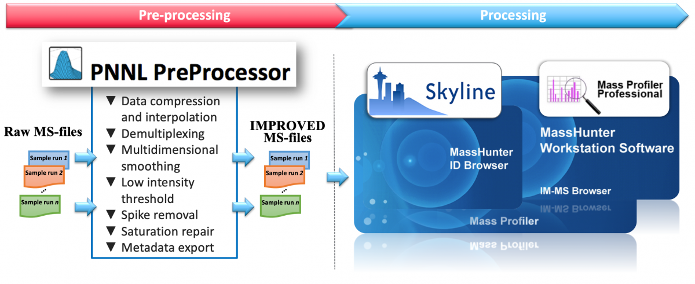
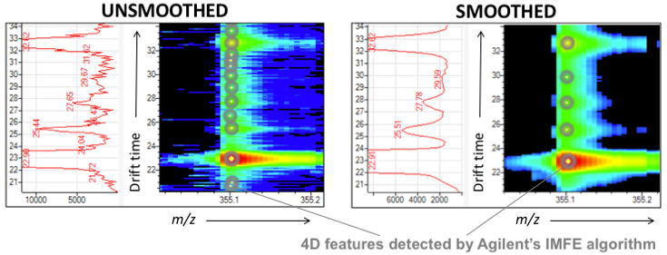

# __PNNL PreProcessor__
Ion mobility-mass spectrometry (IM-MS) provides an increasingly popular platform for analyzing complex samples due to its separation power and ability to differentiate structural isomers, which are difficult to resolve using conventional LC-MS systems. Here we provide a software tool with various algorithms and utilities to improve workflows using this technology: data compression and interpolation, ion mobility demultiplexing, multidimensional smoothing, noise filtering by low intensity threshold and spike removal, saturation repair and metadata export.

### Description
In close collaboration between Pacific Northwest National Laboratory and Agilent Technologies, we have developed this user-friendly tool for Agilent MassHunter (.d) and UIMF mass spectrometry data files (MS-files) and generates new MS-files in the same instrument data format with enhanced signal quality.

Software features:

* Command-line and graphical (workflow style) user interfaces.
* Single-click batch processing of multiple raw MS-files.
* Data compression (by frame and mobility) and filtering by retention time range.
* Multidimensional smoothing of data and repair of saturated peaks.
* PNNL demultiplexing and artifact removal algorithm integrated.
* A new algorithm to remove noise in form of ‘spikes’.
* Ion mobility MS with/without any separation: LC-IM-MS, solid phase extraction (e.g., RapidFire) IM-MS and direct infusion IM-MS.
* All Ions MS-files (data-independent acquisition) with alternating high/low collision energy fragmentation.
* Exporting metadata information of ion mobility frames (e.g., field, pressure, temperature) and MS actuals to text files.
* Multidimensional smoothing for non-ion mobility TOF-MS MS-files (e.g., produced by 6530, 6540, 6545 and 6550 Agilent instruments).

New features:

* Data interpolation of the ion mobility dimension to improve the results of the HRdm demultiplexing and peak deconvolution strategy.
* A selectable pulse coverage percentage to increase sensitivity for low level signals in demultiplexing.
* Increase significantly the number of features consistently detected across your multiple runs while reducing the file size and time for downstream processing.

> Smoothing removes artifacts in jagged peaks, which are common in low-abundance ions. Real signals are enhanced, and variations in abundance, elution and mobility/collisional-cross-section are reduced.

---

__Disclaimer__: the saturation repair software may produce incorrect results for ions with highly convoluted elution/mobility profiles caused by interferences. Please use the current version at your own risk and check the output log files in each data file to verify the repairs made.

If you use the PreProcessor, please cite: Bilbao et al. *A Preprocessing Tool for Enhanced Ion Mobility-Mass Spectrometry-Based Omics Workflows.* Journal of Proteome Research 2021 [https://doi.org/10.1021/acs.jproteome.1c00425](https://doi.org/10.1021/acs.jproteome.1c00425).

### Downloads
* [Software](https://panomics.pnnl.gov/downloads/installers/PNNL-Preprocessor_4.0_2021.10.27.zip)
* [Software installer](https://panomics.pnnl.gov/downloads/installers/PNNL-Preprocessor_4.0_2021.10.27_INSTALLER.exe) [as .zip file](https://panomics.pnnl.gov/downloads/installers/PNNL-Preprocessor_4.0_2021.10.27_INSTALLER.zip)
* [User Guide](https://panomics.pnnl.gov/downloads/installers/PNNL-PreProcessor_UserGuide_4.0_2021.10.27.pdf)

### Acknowledgment

All publications that utilize this software should provide appropriate acknowledgement to PNNL and the PNNL-Preprocessor publication. However, if the software is extended or modified, then any subsequent publications should include a more extensive statement, as shown in the Readme file for the given application or on the website that more fully describes the application.

### Disclaimer

These programs are primarily designed to run on Windows machines. Please use them at your own risk. This material was prepared as an account of work sponsored by an agency of the United States Government. Neither the United States Government nor the United States Department of Energy, nor Battelle, nor any of their employees, makes any warranty, express or implied, or assumes any legal liability or responsibility for the accuracy, completeness, or usefulness or any information, apparatus, product, or process disclosed, or represents that its use would not infringe privately owned rights.

Portions of this research were supported by the NIH National Center for Research Resources (Grant RR018522), the W.R. Wiley Environmental Molecular Science Laboratory (a national scientific user facility sponsored by the U.S. Department of Energy's Office of Biological and Environmental Research and located at PNNL), and the National Institute of Allergy and Infectious Diseases (NIH/DHHS through interagency agreement Y1-AI-4894-01). PNNL is operated by Battelle Memorial Institute for the U.S. Department of Energy under contract DE-AC05-76RL0 1830.

We would like your feedback about the usefulness of the tools and information provided by the Resource. Your suggestions on how to increase their value to you will be appreciated. Please e-mail any comments to proteomics@pnl.gov
